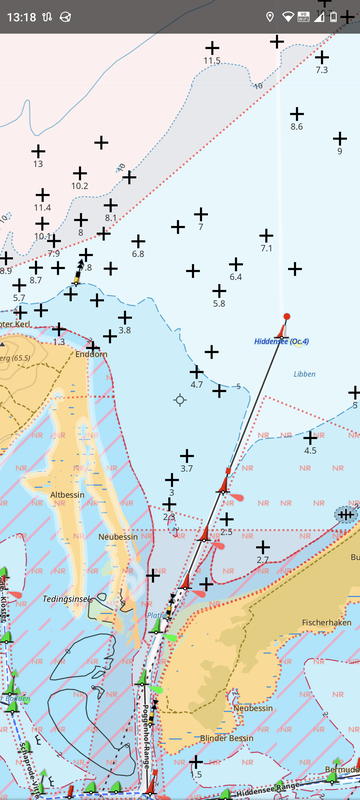

# Depth Data and Rendering

## TL;DR - How to get good depth data in OsmAnd

To install the following files, download them to your phone and open them with OsmAnd (just tap and select OsmAnd).

- install and enable the [marine map style](marine.render.xml)
- install [depth rendering style](depthcontourlines.addon.render.xml) (replace currently installed one)
- install OBFs containing depth data

This only works correctly with [render engine](https://osmand.net/docs/user/personal/global-settings/#map-rendering-engine) 2 and the above mentioned render styles!

### Settings

The custom render styles offer some config option, which can be use to adjust the look to your personal preferences.

- [additional settings](USAGE.md#additional-settings)
- nautical depth
  - line width
  - line color scheme
- dashed contours
- area color scheme
- spot sounding size
- spot sounding distance
- safety contour

The safety contour settings allows to choose a contour line (must be in the dataset!) that is drawn red and depth areas below this depth get an overlay with red diagonal lines.

Here an example of paper style areas, dashed contours and a 2m safety line.

## Data Sources

IMHO the depth data supplied by OsmAnd is just a proof of concept showcase, they are very inaccurate and unreliable and not at all usable for actual navigation or trip planning.

### Germany

The BSH provides access to nautical data in the [GeoSeaPortal](https://www.bsh.de/EN/DATA/GeoSeaPortal/geoseaportal_node.html). There is no documentation, but simply by examining what the webviewer does reveals some [WMS](https://en.wikipedia.org/wiki/Web_Map_Service) endpoints. Depth contours and areas can be found in

- https://www.geoseaportal.de/wss/service/NAUTHIS_Hydrography/guest
- https://www.geoseaportal.de/wss/service/NAUTHIS_SkinOfTheEarth/guest

 What is particularly nice is, that the data can be downloaded as `application/json;type=geojson`, so we can pull vector data from this server! You can download the entire dataset in one go.

BTW: They also provide a [tidal current atlas](https://en.wikipedia.org/wiki/Web_Map_Service) for free! In the webviewer you cannot select the time before/after HW, but if you use [QGIS](https://www.qgis.org/) as WMS client, you can explore the datasets and switch between different times.

- https://www.geoseaportal.de/wss/service/Gezeitenstrom_Nordsee/guest
- https://www.geoseaportal.de/wss/service/Gezeitenstrom_Kueste/guest

### Netherlands

RWS provides a full [ENC](https://en.wikipedia.org/wiki/Electronic_navigational_chart) with contours and spot soundings for free for some regions of NL like the Waddenzee and Zeeland.

- https://www.vaarweginformatie.nl/frp/main/#/page/infra_enc

Using [GDAL](https://gdal.org/programs/ogr2ogr.html) the vector data can be extracted from the ENC.

## OBF Generation

I managed to create an OBF containing depth contours and spot soundings. The workflow is roughly like this:

- download raw data (GeoJSON, ENC, ...)
- convert to format readable by QGIS (if necessary)
- import into [QGIS](https://www.qgis.org/)
- filter the relevant rows
- add columns
  - spot soundings
    - `point=depth`
    - `depth=<DEPTH>`
  - contour lines 
    - `contour=depth`
    - `depth=<VALDCO>`
    - `contourtype=[5m,10m,20m,50m,100m,...]`
  - contour areas 
    - `area=depth`
    - `areatype=[0m,2m,5m,10m,100m]`
- export layer as geopackage only containing the added columns
- import into [JOSM](https://josm.openstreetmap.de/) via [OpenData](https://wiki.openstreetmap.org/wiki/JOSM/Plugins/OpenData) plugin
- save as [OSM XML](https://wiki.openstreetmap.org/wiki/OSM_XML) file
- convert OSM to [OBF](https://osmand.net/docs/technical/osmand-file-formats/osmand-obf/) using [OsmAndMapCreator](https://osmand.net/docs/versions/map-creator/)

Terrible, no command line tools, but it works.

