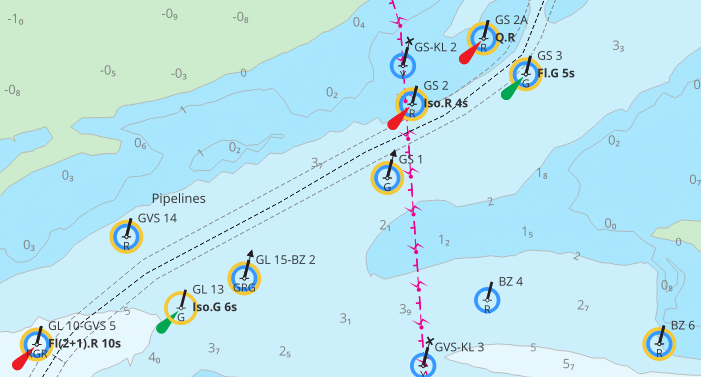
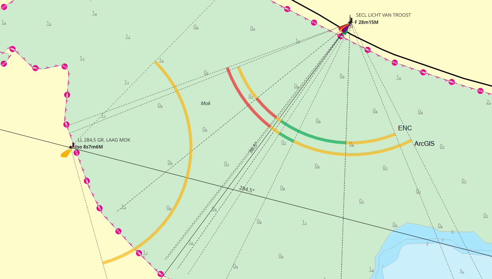
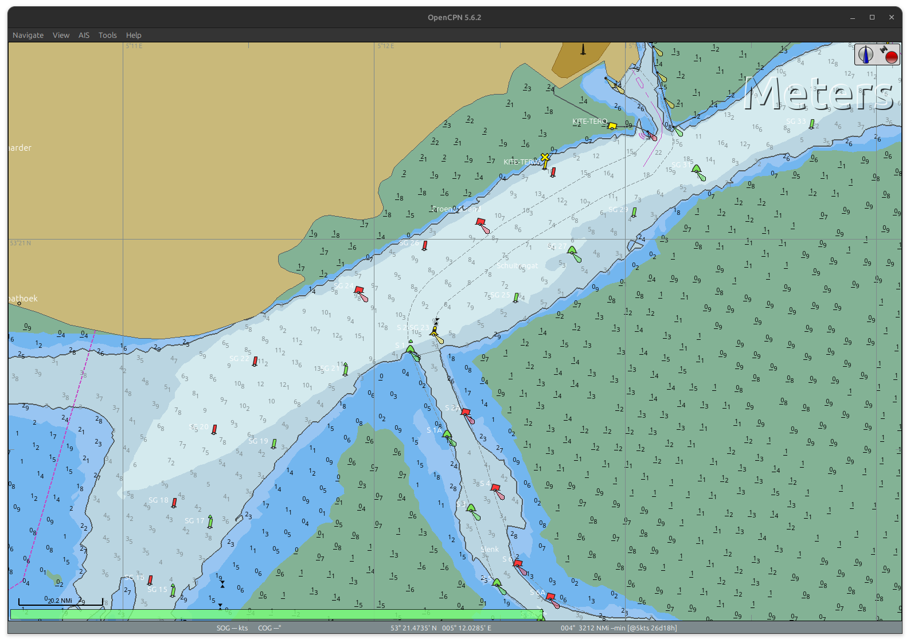
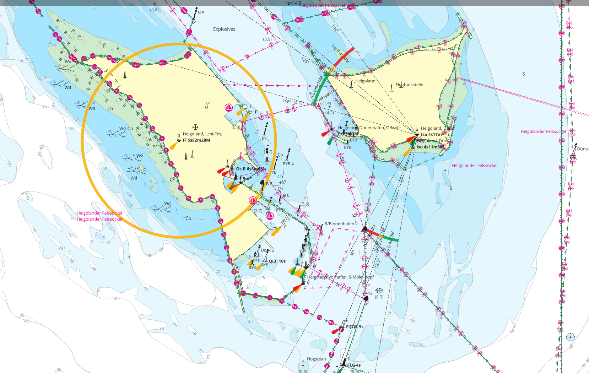
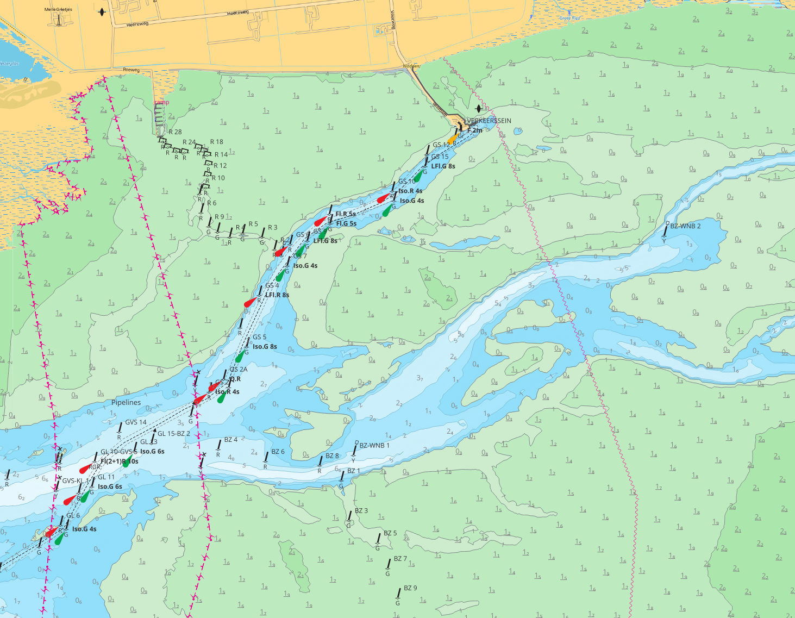
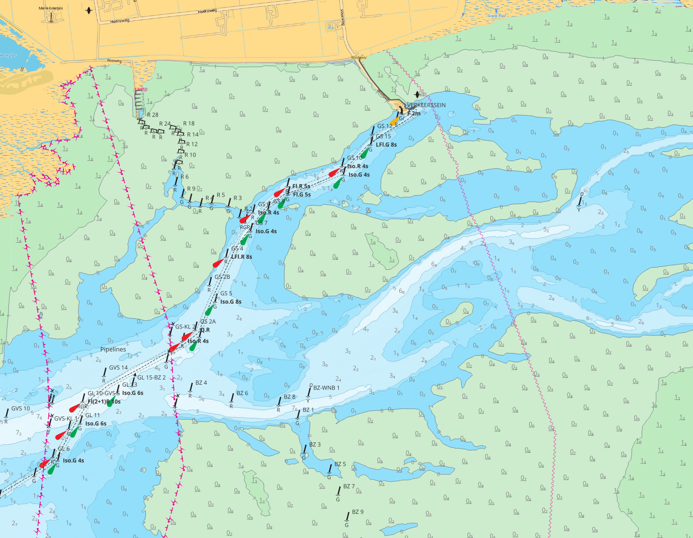
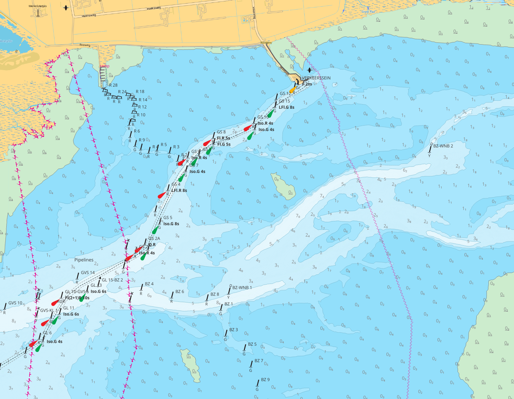
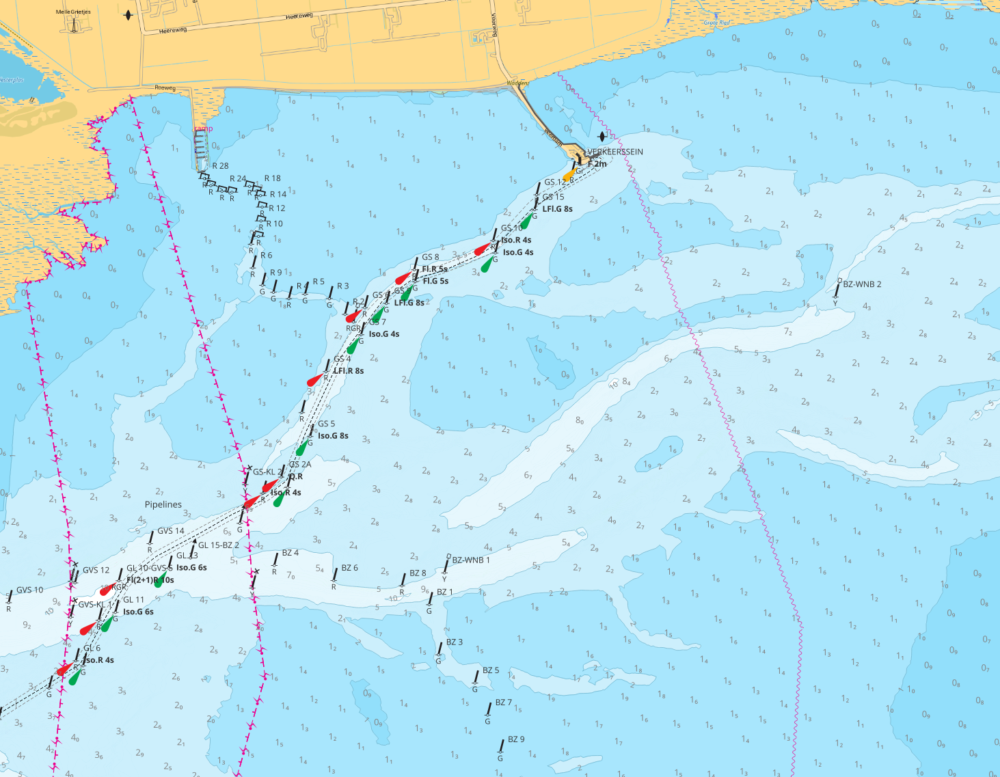
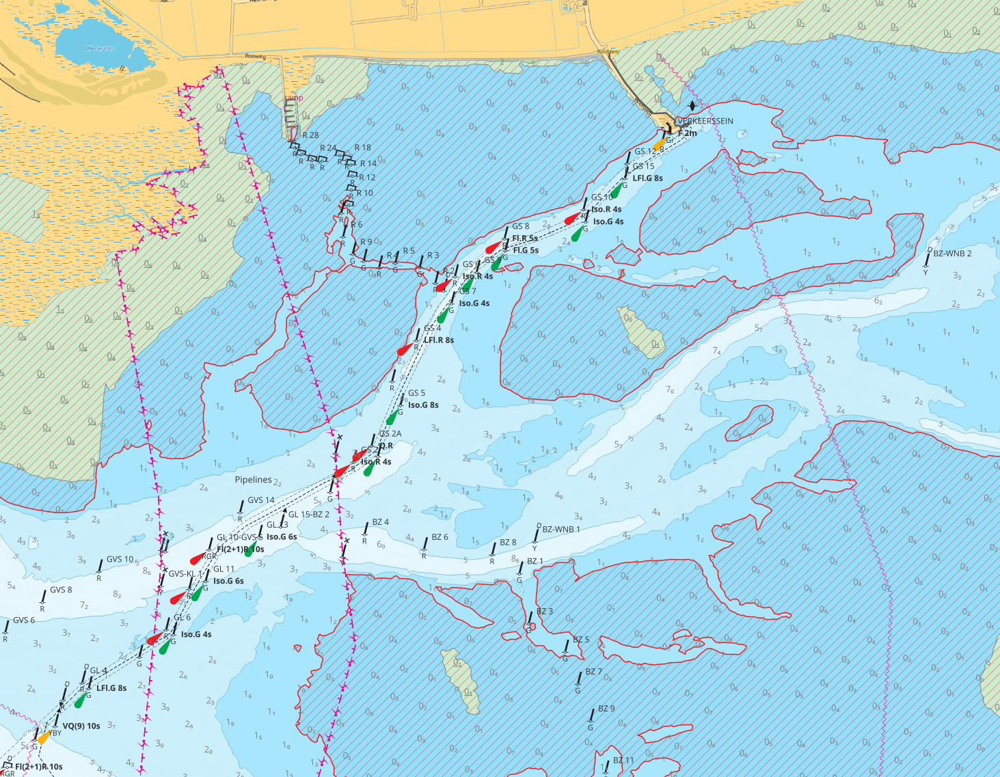

# S-57 ENC conversion

TL;DR --> see [USAGE.md](USAGE.md)

How to convert an ENC (electronic navigational chart) to map tiles and how to use them to update [OSM](https://www.openstreetmap.org/) data.

This is based on a [post](https://www.sigterritoires.fr/index.php/affichage-des-cartes-marines-s57-dans-qgis/) I found on the net, but it did not work well and I did not like look, so I reworked it. The [S-57 ENC](http://www.s-57.com/) consisting of many files is transformed into shape files with [`ogr2ogr`](https://gdal.org/programs/ogr2ogr.html), one for each layer. Then these shape files are read by [QGIS](https://www.qgis.org/) and then get rendered as specified in the [INT1](https://www.nauticalcharts.noaa.gov/publications/us-chart-1.html) (almost).

## Data Sources

- S-57 ENC: https://www.vaarweginformatie.nl/frp/main/#/page/infra_enc
- Buoys dataset: https://data.overheid.nl/dataset/2c5f6817-d902-4123-9b1d-103a0a484979
- Beacons dataset: https://data.overheid.nl/dataset/c3d9facc-5b74-4cae-8841-135890f44049

## Map tiles

I will describe my procedure to update the buoys in the Waddenzee. The necessary commands are stored in the `makefile` and I use Linux.

1. download ENC from URL above
2. extract the ZIP `make unzip`
3. convert the ENC to shape files with `make shapes` (It uses the mapping CSVs from OpenCPN.)
4. download vaarwegmarkeringen `make vwm`
5. open `map.qgs` with QGIS (You may want to add the `icons` path to QGIS: settings, options, system, SVG path)
6. export map tiles
   - processing, toolbox, raster tools, generate XYZ tiles (dir)
   - extent: draw on canvas and select the region you want to get rendered
   - max zoom: 16
   - set output dir to `tiles` subdir
   - html file: skip
   - run - this takes a while :coffee:

Now you can open `tiles/index.html` and view the tiles in your browser, you will get a pretty up to date and accurate navigational chart.

There is a public server with the tiles I have created. By enabling the OpenSeaMap overlay you can directly compare the positions of buoys and beacons in OSM to those given in the dataset by RWS. You can use these map tiles in JOSM an OsmAnd if you like (see below and [USAGE.md](USAGE.md)).

This procedure should in principle work for other ENCs as well, you just have to enable the buoys and beacons layer from the ENC and maybe make some other adjustments. The buoys and beacons for the Waddenzee are pulled from the dedicated datasets mentioned above which are more up to date than the data in the ENC.

## QGIS Server

QGIS comes with a [server component](https://docs.qgis.org/latest/en/docs/server_manual/), that provides among others a WMS server. So, you can run QGIS Server and create rendered tiles on demand as they are requested. Unfortunately this tile rendering is computationally expensive, so it would make much sense to cache the tiles. I use [MapProxy](https://mapproxy.org/) for tile caching, and it also provides [meta tiling](https://mapproxy.org/docs/latest/labeling.html#meta-tiles), which speeds up tile creation even more. To run QGIS server and MapProxy together, you can use the make and Docker files in this project.

- `make serve` start Python based webserver to server generated tiles
- `make qgis` starts QGIS server and MapProxy (need to be installed)
- `make docker` builds a Docker image and runs them in Docker

The necessary software needs to be installed, of course.

## Differences in the data

There are differences between the data in the ENC (yellow circles) and those in the dataset above (blue circles). Compared with the data supplied in the [Berichten aan Zeevarenden](https://www.defensie.nl/onderwerpen/berichten-aan-zeevarenden) the data in the dedicated datasets is correct.

I also found differences in sector lights. As can be seen in the example image below, there are different sector definitions in the ENC and in the dedicated dataset. I compared these data with what is given in the [official and up to date Lichtenlijst](https://www.defensie.nl/downloads/publicaties/2022/07/27/hp2a) (Nr. 1496) to confirm that the information in the ENC is not correct. The data in the beacons dataset agrees with the data in the Lichtlijst (at least for this example).

There are also differences in the positions of the objects. The ENC encodes the positions in Lat and Lon ([EPSG:4326](https://epsg.io/4326)) whereas the other data set uses the UTM grid ([EPSG:25831](https://epsg.io/25831)), this might be a source of error. The Sectorlicht den Oever (Nr. 1586) shows a difference in position of ~40m. The Lichtenlijst only gives the position to 0.1' (~180m), so both are correct within this accuracy, but again the ENC seems to be off, compared with an Orthophoto.

The ENC provides much more information than the dedicated dataset (i.e. sector information for smaller lights like leading lights and light range data), but unfortunately it does contain some errors and the latter seems to be more reliable.

I wrote a message to RWS and reported these differences. They answered that they currently do not have a system that transfers the data automatically from different data sources into the ENC. _The ENC is handmade!_

## Updating OSM data

### JOSM

I edit OSM data with [JOSM](https://josm.openstreetmap.de/). JOSM is pretty easy to use, how it works is explained in the [Wiki](https://josm.openstreetmap.de/wiki/Introduction). You can add the generated map tiles to JOSM as imagery layer.

- imagery, imagery preferences
- add TMS with URL `file:///path/to/qgis/tiles/{zoom}/{x}/{y}.png` or [one of these URls](USAGE.md#raster-overlay)
- then activate the layer from imagery menu

You can use the WMS at `https://geo.rijkswaterstaat.nl/services/ogc/gdr/vaarweg_markeringen/ows` directly in JOSM, too, but then you do not get the metadata like name and light descriptor of the objects.

To get the seamarks displayed correctly in JOSM and make it easier to edit them you should add (under settings)

- Map Paint Style: `https://raw.githubusercontent.com/OpenSeaMap/josm/master/INT1_Seamark.mapcss`
- Plugin: SeaChart
- Plugin: SeaMapEditor
- Tagging Preset: `https://github.com/OpenSeaMap/josm/raw/master/INT-1-preset.xml`

For editing seamarks you may want to set a filter filtering on `seamark` and activate hide mode, such that _only_ seamarks are displayed to make it less confusing. Now you can update buoys and other seamarks by simply drawing them on top of the chart.

### scripted updates

It is possible to update the positions and other metadata with a script that pulls the information from the above datasets and inserts them into OSM. There are some problems though.

- How to match the information in the dataset to node in OSM correctly?
- How to handle additions and deletions correctly?
- When moving nodes, sometimes connected nodes need to moved along. How to handle this correctly?

I created a [script](update.py) that manipulates OSM files. The procedure works like this:

- Download data with JOSM
- Save as OSM file `in.osm`
- remove the data layer from JOSM
- Run `update.py -g vwm/drijvend.json` (use `-h` to get help for more arguments)
- Load the `out.osm` into JOSM (happens automatically if JOSM remote control in enabled)
- Review the changes (just click the links in the logging output to zoom the modified nodes)
- Upload the data

### StreetComplete

There is another app for updating OSM in a different and very easy way: [StreetComplete](https://github.com/streetcomplete/StreetComplete). IMHO this a great app, well-designed to provide basically a zero knowledge access to contribute to OSM. Unfortunately not for seamarks, which admittedly are special to most people. It can be installed from the [PlayStore](https://play.google.com/store/apps/details?id=de.westnordost.streetcomplete).

## OpenCPN

For comparison the ENC files can also be viewed with [OpenCPN](https://opencpn.org/).

## OsmAnd

see [USAGE.md](USAGE.md#osmand)

## Germany

It is possible to extract vector data out of the WMS of the german [GeoSeaPortal](https://www.geoseaportal.de/mapapps/resources/apps/navigation/) as GeoJSON. With this data QGIS can be used to render a much nicer looking map that contains more information than what is available directly at the link above. Run `make bsh` and enable the Deutschland layer group in the map. It does not contain spot soundings but depth contours, which in some areas get displayed multiple times. The same contour from different zoom levels and thus as a more detailed and as a coarser version, so read the map carefully.

## Height of Tide

In QGIS it is possible to add an offset to the depth data, which can be used to show soundings and depth contours at certain height of the tide. Unfortunately the contour levels in the data above LAT are only available as integer meters and this offset is applied globally to the entire map. But it may give you a visual impression of how the water level affects the navigable areas. Additionally, it is possible to highlight shallow areas and draw a safety contour (with the above restrictions). To change these values set (integer) values for `height_of_tide` and `safe_depth` in the project properties (Crtl+Shift+P).

Height of tide = 0m (LAT)

Height of tide = 1m

Height of tide = 2m

Height of tide = 3m

Height of tide = 2m, safety contour = 1m

