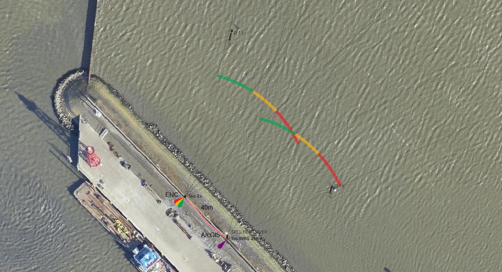
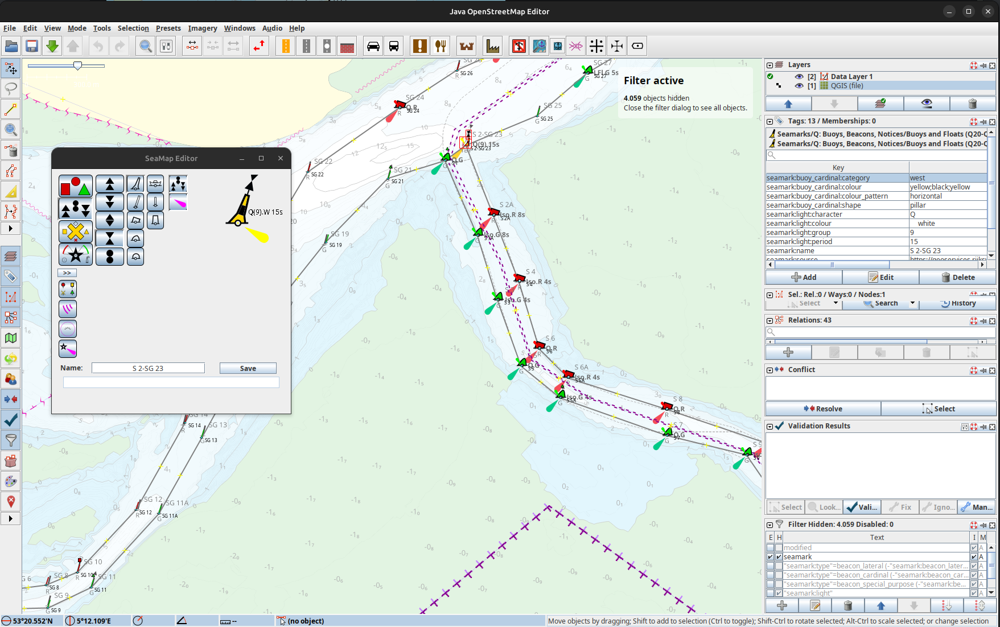

# S-57 ENC conversion

How to convert an ENC (electronic navigational chart) to map tiles and how to use them to update [OSM](https://www.openstreetmap.org/) data.

This is based on a [post](https://www.sigterritoires.fr/index.php/affichage-des-cartes-marines-s57-dans-qgis/) I found on the net, but it did not work well and I did not like look, so I reworked it. The [S-57 ENC](http://www.s-57.com/) consisting of many files is transformed into shape files with [`ogr2ogr`](https://gdal.org/programs/ogr2ogr.html), one for each layer. Then these shape files are read by [QGIS](https://www.qgis.org/) and rendered as specified in the [INT1](https://www.nauticalcharts.noaa.gov/publications/us-chart-1.html) (almost).

## Data Sources

- S-57 ENC: https://www.vaarweginformatie.nl/frp/main/#/page/infra_enc
- Buoys dataset: https://data.overheid.nl/dataset/2c5f6817-d902-4123-9b1d-103a0a484979
- Beacons dataset: https://data.overheid.nl/dataset/c3d9facc-5b74-4cae-8841-135890f44049

## Map tiles

I will describe my procedure to update the buoys in the Waddenzee. The necessary commands are stored in the `makefile` and I use Linux.

1. download ENC from URL above
2. extract the ZIP `make unzip`
3. convert the ENC to shape files with `make shapes` (It uses the mapping CSVs from OpenCPN.)
4. download vaarwegmarkeringen `make vwm` 
5. open `map.qgs` with QGIS (You may want to add the `icons` path to QGIS: settings, options, system, SVG path)
6. export map tiles
   - processing, toolbox, raster tools, generate XYZ tiles (dir)
   - extent: draw on canvas and select the region you want to get rendered
   - max zoom: 16
   - set output dir to `tiles` subdir
   - html file: skip
   - run - this takes a while :coffee:

Now you can open `tiles/index.html` and view the tiles in your browser, it is a pretty up to date and accurate navigational chart.

There is a [public server](http://waddenzee.duckdns.org/) with the tiles I have created. By enabling the OpenSeaMap overlay you can directly compare the positions of buoys and beacons in OSM and the dataset by RWS. You can use these map tiles in JOSM an OsmAnd if you like (see below).

This procedure should in principle work for other ENCs as well, you just have to enable the buoys and beacons layer from the ENC. The buoys and beacons for the Waddenzee are pulled from the dedicated datasets mentioned above which is more up to date than the data in the ENC.

## Differences in the data

There are differences between the data in the ENC (yellow circles) and those in the dataset above (blue circles). Compared with the data supplied in the [Berichten aan Zeevarenden](https://www.defensie.nl/onderwerpen/berichten-aan-zeevarenden) the data in the dedicated dataset in correct.

I also found differences in sector lights. As can be seen in the example image below, there are different sector definitions in the ENC and in the above dataset accessed via ArcGIS API. I compared these data with what is given in the [official and up to date Lichtenlijst](https://www.defensie.nl/downloads/publicaties/2022/07/27/hp2a) (Nr. 1496) to confirm that the information in the ENC is not correct. The data in the beacons dataset agrees with the data in the Lichtlijst (at least for this example).

There are also differences in the positions of the objects. The ENC encodes the positions in Lat and Lon ([EPSG:4326](https://epsg.io/4326)) whereas the other data set uses the UTM grid ([EPSG:25831](https://epsg.io/25831)), this might be source of error. The Sectorlicht den Oever (Nr. 1586) shows a difference in position of ~40m. The Lichtenlijst only gives the position to 0.1' (~180m), so both are correct within this accuracy, but again the ENC seems to be off, compared with an Orthophoto.

The ENC provides much more information than the Vaarweg markeringen dataset (i.e. sector information for smaller lights like leading lights and light range data), but unfortunately it does contain some errors and the latter seems to be more reliable.

## Updating OSM data with JOSM

I edit OSM data with [JOSM](https://josm.openstreetmap.de/). JOSM is pretty easy to use, how it works is explained in the [Wiki](https://josm.openstreetmap.de/wiki/Introduction). You can add the generated map tiles to JOSM as imagery layer.

- imagery, imagery preferences
- add TMS with URL `file:///path/to/qgis/tiles/{zoom}/{x}/{y}.png` or `http://waddenzee.duckdns.org/{zoom}/{x}/{y}.png`
- then activate the layer from imagery menu

You could use the WMS at `https://geo.rijkswaterstaat.nl/services/ogc/gdr/vaarweg_markeringen/ows` directly in JOSM, but then you do not get the metadata like name and light descriptor of the objects.

To get the seamarks displayed correctly in JOSM and make it easier to edit them you should add (under settings)

- Map Paint Style: `https://raw.githubusercontent.com/OpenSeaMap/josm/master/INT1_Seamark.mapcss`
- Plugin: SeaChart
- Plugin: SeaMapEditor
- Tagging Preset: `https://github.com/OpenSeaMap/josm/raw/master/INT-1-preset.xml`

For editing seamarks you may want to set a filter filtering on `seamark` and activate hide mode, such that only seamarks are displayed to make it less confusing. Now you can update buoys and other seamarks by simply drawing them on top of the chart.

### scripted updates

Theoretically it is possible to update the positions and other metadata with a script that pulls the information from the above dataset and inserts it into OSM. There are some problems though.

- How to match the information in the dataset to node in OSM correctly?
- How to handle additions and deletions correctly?
- When moving nodes, sometimes connected nodes need to moved along. How to handle this correctly?

I will look into the scripting functionality of JOSM, but before uploading data modified by a script it needs to checked and corrected manually.

## OpenCPN

The ENC files can also be viewed in [OpenCPN](https://opencpn.org/).

## OsmAnd

[OsmAnd](https://osmand.net/) is a very good map and navigation app for all kinds of activities. It features a boating profile where seamarks are displayed and it is possible to include map tiles from other sources like sat imagery or custom tiles. It is pretty complex, you should [read the manual](https://osmand.net/docs/intro).

Enable the boating [profile](https://osmand.net/docs/user/personal/profiles/) in the settings and also enable the [nautical charts](https://osmand.net/docs/user/plugins/nautical-charts) and [online maps](https://osmand.net/docs/user/plugins/online-map) extensions. When you switch to the boating profile the land areas are shown in sand colour and seamarks like buoys are displayed. You can [customize the map](https://osmand.net/docs/user/map/configure-map-menu) by tapping the boat icon in the top left corner. 

You have to [download map data](https://osmand.net/docs/user/start-with/download-maps) for the regions you are interested it. These maps already contain the seamarks, but they are only displayed in the nav chart map style (boating profile). You may optionally download worldwide seamarks, too, which contains seamarks only, but worldwide, so the map shows seamarks also for regions where did not download the (detailed) map data for.

The map data is based on OSM and gets updated monthly, so the changes you make to OSM data using JOSM will not show up immediately. You may enable [live updates](https://osmand.net/docs/user/personal/maps#osmand-live) to get the updates more quickly, but some features may show up multiple times (from map data, worldwide seamarks and the update). 

OSM contains two render engines, version 2 is OpenGL based, it's faster and not bound to fixed zoom levels, but it only shows all buoys if zoomed in very closely, and they are [off position](https://github.com/osmandapp/OsmAnd/issues/17413) as well. I do prefer the old version 1 render engine.

### Raster Maps

To add a [custom raster map](https://osmand.net/docs/user/map/raster-maps), tap top left, map source, add manually, then

- name: name of this map
- zoom levels: 10 to 16
- URL: `http://waddenzee.duckdns.org/{0}/{1}/{2}.png` (or just click [here](http://osmand.net/add-tile-source?name=Waddenzee&min_zoom=10&max_zoom=16&url_template=http://waddenzee.duckdns.org/{0}/{1}/{2}.png))
  - buoys only: `http://waddenzee.duckdns.org/seamarks/{0}/{1}/{2}.png` (or just click [here](http://osmand.net/add-tile-source?name=Waddenzee+Boeien&min_zoom=10&max_zoom=16&url_template=http://waddenzee.duckdns.org/seamarks/{0}/{1}/{2}.png))
- format: SQlite (optional)

This way you can use any TMS maps you find on the net or upload the tiles you have generated with QGIS to a webserver. There are already some predefined ones built into OsmAnd.

You can use this raster layer as an [overlay](https://osmand.net/docs/user/map/raster-maps#overlay-layer) with a transparency slider displayed at the bottom of the map, so you can seamlessly switch between two maps. The raster map tiles can be [pre-downloaded](https://osmand.net/docs/user/map/raster-maps#download--update-tiles) into the cache, to make them available for offline usage. This navigational chart combined with a [sat image](http://osmand.net/add-tile-source?name=World+Imagery&min_zoom=2&max_zoom=20&url_template=https://server.arcgisonline.com/arcgis/rest/services/World_Imagery/MapServer/tile/{z}/{y}/{x}) is a very handy tool.

### Custom style

I tweaked the render style for nautical maps to better fit my personal preferences and named it [marine style](marine.render.xml). You can try it by importing it into OsmAnd. Just download and click on it, then activate it in the map settings. I replaced the annoyingly bright green fairway colour with a transparent white, to just give a slight visual hint where the fairway is. The colour of water areas was changed to a light blue, white does not look good and there are no depth area polygons available to display shallow areas in blue and deep water white as in a proper nautical chart and tidal flats are shown in green. In OsmAnd there is depth data available for the Netherlands, but _not_ for drying heights. And I don't know where this data actually comes from or how accurate it is. I wouldn't rely on it, but at least it looks nice.

 

## Germany

It is possible to extract vector data out of the WMS of the german [GeoSeaPortal](https://www.geoseaportal.de/mapapps/resources/apps/navigation/) as GeoJSON. With this data QGIS can be used to render a much nice looking map that contains more information than what is available directly at the link above. Run `make bsh` and enable the Deutschland layer group in the map.

