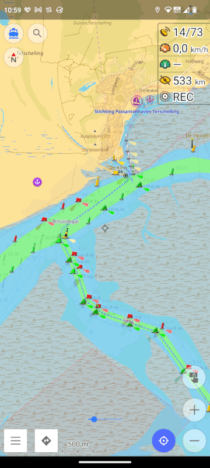
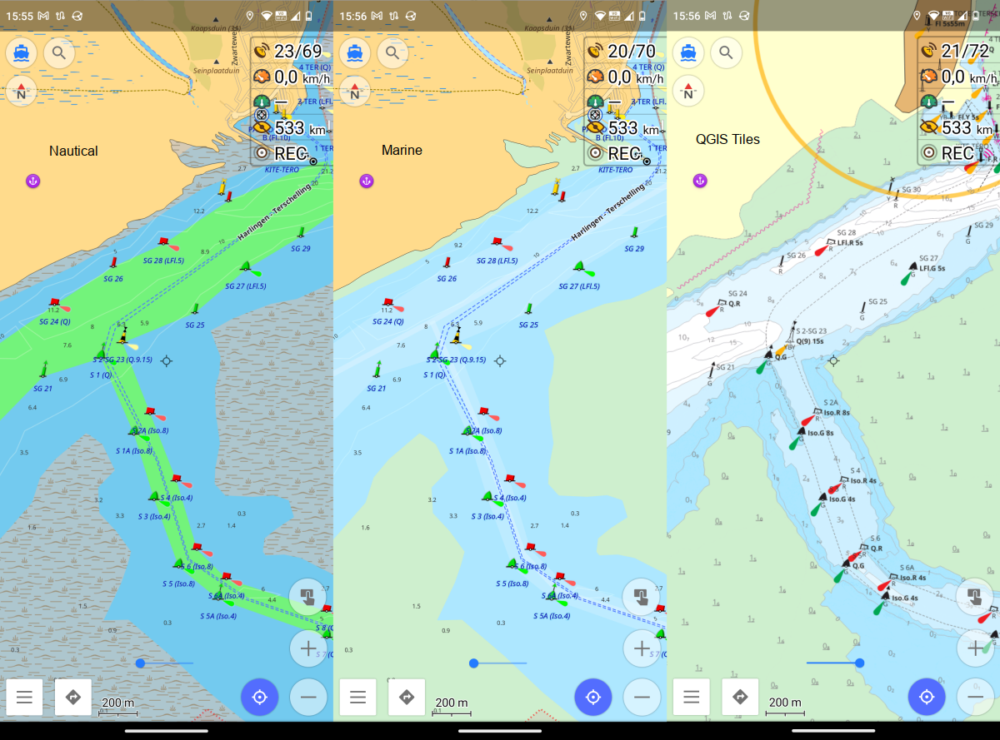
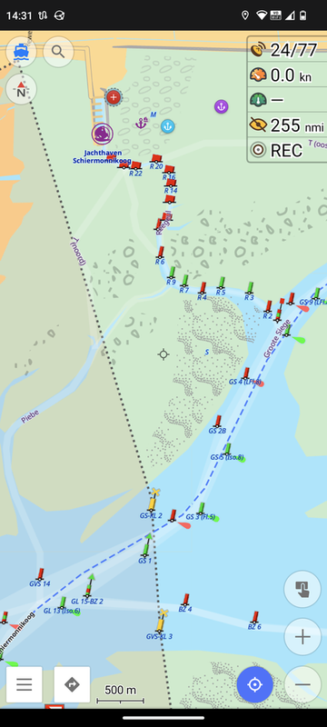
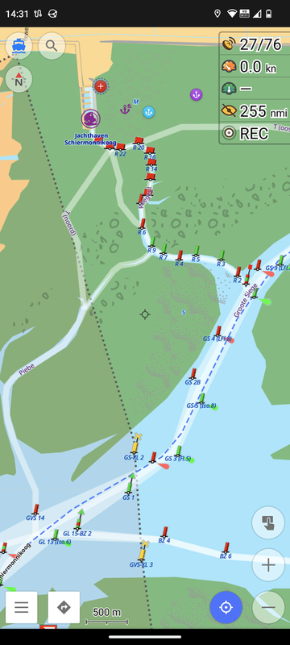

# How to use maps generated by this project

To use the maps generates by this project you do not need to know the [details of the entire process](README.md). This brief guide tells you how to simply use the use maps and other resources I provide.

## Web Service

http://waddenzee.duckdns.org/

On this website you can view a map of the Waddenzee based on the data provided by RWS. You can switch layers in the top right corner and use some simple measurement and plotting tools on the left. The map looks like in the example above.

Additionally, you can switch to other layers, i.e. an [aerial image as background with depth contours and buoys as overlay](img/sat+contours.png).

There are several overlays to choose from.

- ENC - [ENC by RWS](https://www.vaarweginformatie.nl/frp/main/#/page/infra_enc) with Buoys and Beacons from the ENC
- Depth Contours - DC only from the ENC, transparent
- Buoys and Beacons - from [VWM dataset](https://data.overheid.nl/dataset/2c5f6817-d902-4123-9b1d-103a0a484979) (more up to date)
- Vaarweg Markeringen - like Buoys and Beacons but directly from the [server by RWS](https://geo.rijkswaterstaat.nl/services/ogc/gdr/web/)

## OpenSeaMap

https://map.openseamap.org/

The positions and metadata of buoys and other objects are worked into the OSM database and thus are available in the OpenSeaMap project and other software that uses this data.

## OsmAnd

https://osmand.net/

:point_right: [YouTube OsmAnd Playlist](https://www.youtube.com/playlist?list=PLVV1f2QQn7GxWiF0C0-e9oJkfkdYLZGms) with demonstration on how to use OsmAnd.

[OsmAnd](https://osmand.net/) is a very good map and navigation app for all kinds of activities. It features a boating profile where seamarks are displayed, and it is possible to include map tiles from other sources like sat imagery or custom tiles. It is pretty complex, you should [read the manual](https://osmand.net/docs/intro).

_Consider paying for OsmAnd to support their amazing work!_ 

You have to [download map data](https://osmand.net/docs/user/start-with/download-maps) for the regions you are interested it. These maps _already contain the seamarks_, but they are only displayed in the nav chart map style (boating profile). You may optionally download worldwide seamarks, too, which contains seamarks only, but worldwide, so the map shows seamarks also for regions where did not download the (detailed) map data for.

Enable the boating [profile](https://osmand.net/docs/user/personal/profiles/) in the settings and also enable the [nautical charts](https://osmand.net/docs/user/plugins/nautical-charts) and [online maps](https://osmand.net/docs/user/plugins/online-map) extensions. When you switch to the boating profile the land areas are shown in sand colour and seamarks like buoys are displayed. You can [customize the map](https://osmand.net/docs/user/map/configure-map-menu) by tapping the boat icon in the top left corner.

The map data is based on OSM and gets updated _monthly_, so the changes made to OSM data using JOSM will not show up immediately. You may enable [live updates](https://osmand.net/docs/user/personal/maps#osmand-live) to get the updates more quickly, but some features may show up multiple times (from map data, worldwide seamarks and the update).

OSM contains two render engines, version 2 is OpenGL based, it's faster and not bound to fixed zoom levels, but it only shows all buoys if zoomed in very closely, and they are [off position](https://github.com/osmandapp/OsmAnd/issues/17413) as well (has been fixed but might not be available yet). I do prefer the old version 1 render engine.

### Boating profile

- enable [boating profile](https://osmand.net/docs/user/personal/profiles/)
- enable [plugins](https://osmand.net/docs/user/plugins/)
  - [nautical charts](https://osmand.net/docs/user/plugins/nautical-charts) 
  - [online maps](https://osmand.net/docs/user/plugins/online-map) 

Now you should be able to see buoys and other seamarks on the chart depending on the zoom level.

### Depth and Lights

- [DEPTH.md](DEPTH.md)
- [LIGHTS.md](LIGHTS.md)

### Raster Overlay

To add the Waddenzee map as in the web service above to OsmAnd as [custom raster map](https://osmand.net/docs/user/map/raster-maps) just click these links below on your device with OsmAnd installed (SQLite storage recommended)

- [Waddenzee with Depth Soundings](http://osmand.net/add-tile-source?name=Waddenzee&min_zoom=8&max_zoom=16&url_template=http://waddenzee.duckdns.org/{0}/{1}/{2}.png) `http://waddenzee.duckdns.org/{0}/{1}/{2}.png`
- [Waddenzee Buoys and Beacons only](http://osmand.net/add-tile-source?name=Waddenzee+Boeien&min_zoom=8&max_zoom=16&url_template=http://waddenzee.duckdns.org/seamarks/{0}/{1}/{2}.png) `http://waddenzee.duckdns.org/seamarks/{0}/{1}/{2}.png`
- [Waddenzee Depth Contours only](http://osmand.net/add-tile-source?name=Waddenzee+Contours&min_zoom=8&max_zoom=16&url_template=http://waddenzee.duckdns.org/contours/{0}/{1}/{2}.png) `http://waddenzee.duckdns.org/contours/{0}/{1}/{2}.png`

You may also want to use a satellite image overlay.

- [World Imagery](http://osmand.net/add-tile-source?name=World+Imagery&min_zoom=2&max_zoom=20&url_template=https://server.arcgisonline.com/arcgis/rest/services/World_Imagery/MapServer/tile/{0}/{1}/{2}) (https://hub.arcgis.com/datasets/esri::world-imagery/about)
- [LuchtfotoQuick23LR](http://osmand.net/add-tile-source?name=LuchtfotoQuick23LR&min_zoom=2&max_zoom=18&url_template=https://service.pdok.nl/hwh/luchtfotorgb/wmts/v1_0?layer=2023_quick_orthoLR%26style=default%26tilematrixset=EPSG:3857%26Service=WMTS%26Request=GetTile%26Version=1.0.0%26Format=image%2Fjpg%26TileMatrix={0}%26TileCol={1}%26TileRow={2}) (https://www.pdok.nl/introductie/-/article/luchtfoto-pdok)
- [LuchtfotoQuick23HR](http://osmand.net/add-tile-source?name=LuchtfotoQuick23HR&min_zoom=2&max_zoom=20&url_template=https://service.pdok.nl/hwh/luchtfotorgb/wmts/v1_0?layer=2023_quick_orthoHR%26style=default%26tilematrixset=EPSG:3857%26Service=WMTS%26Request=GetTile%26Version=1.0.0%26Format=image%2Fjpg%26TileMatrix={0}%26TileCol={1}%26TileRow={2}) 

Then you can use these maps as an [overlay](https://osmand.net/docs/user/map/raster-maps#overlay-layer). You may want to [pre-download](https://osmand.net/docs/user/map/raster-maps#download--update-tiles) tiles for offline usage at sea. To get updated map tiles into OsmAnd you need to [clear the tile cache](https://osmand.net/docs/user/map/raster-maps/#clear-raster-map-cache) or set an expiration period, then new updated tiles are downloaded from the server (pre-download again for offline usage).

With the transparency slider you can seamlessly blend between the base map and the overlay.

### Marine Style

To make the vector map look more like a nautical chart (drying heights green) you may want to use the marine rendering style. It also fixes the [wrong z ordering of tidal flats](https://github.com/osmandapp/OsmAnd/issues/17835) and [added rendering of mussel banks](https://github.com/osmandapp/OsmAnd/issues/17827) (`seabed=shells`) and [shoals](https://github.com/osmandapp/OsmAnd/issues/17897) (`natural=shoal`).

- download the [marine stlye](https://github.com/quantenschaum/mapping/raw/master/marine.render.xml)
- open it in OsmAnd (just tap the downloaded file)
- select it as rendering style in the boating profile

:exclamation: [This only works correctly with render engine 2 (OpenGL)!](https://github.com/osmandapp/OsmAnd/issues/17835)

Below you seen an example of the nautical style that comes with OsmAnd, the marine style and the raster overlay with depth soundings.

#### Additional Settings

The marine style has [additional settings](https://youtu.be/P7Xc7tvhwCw) available at the very bottom of the map configuration: 

- fairway color 
- wetland color
- shells style 

You can choose different colorings to adjust the map to your liking, either light like a paper chart or with more contrast for situations in bright sunlight. 

## Chart Plotters

It is possible to use [OSM based charts on Garmin chart plotters](https://wiki.openstreetmap.org/wiki/OpenSeaMap_and_Garmin_nautical_chart_plotter) and others. BBBike provides an [online service to extract OSM data](https://extract.bbbike.org/) in various formats. Below is an image of OpenSeaMap on the good old Garmin eTrex Vista, somewhat small, but it works.

