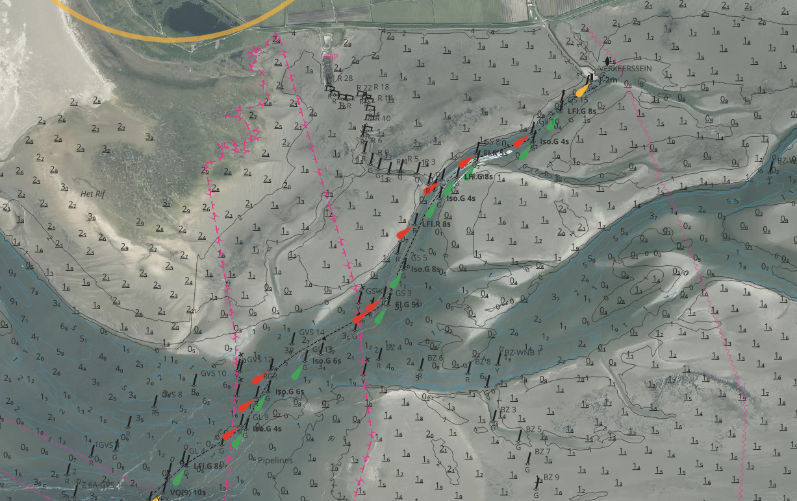
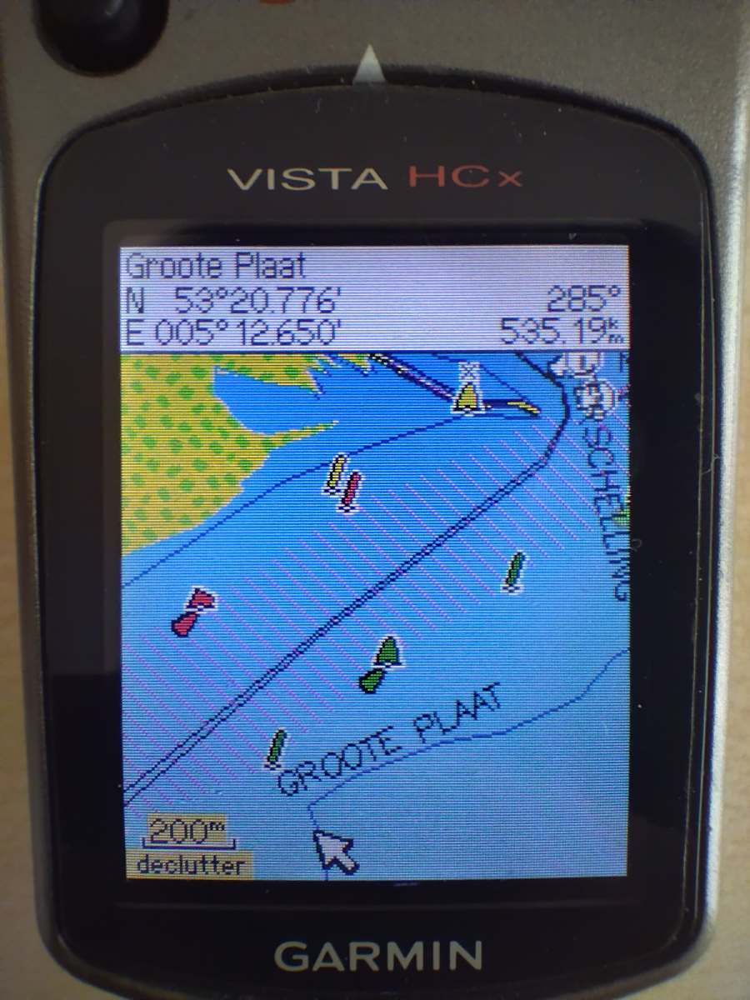

# How to use maps generated by this project

To use the maps generates by this project you do not need to know the [details of the entire process](README.md). This brief guide tells you how to simply use the use maps and other resources I provide.

## Web Service

http://waddenzee.duckdns.org/

On this website you can view a map of the Waddenzee based on the data provided by RWS. You can switch layers in the top right corner and use some simple measurement and plotting tools on the left. The map looks like in the example above.

Additionally you can switch to other layers, i.e. an aerial image as background with depth contours and buoys as overlay.

## OpenSeaMap

https://map.openseamap.org/

The positions and metadata of buoys and other objects are worked into the OSM database and thus are available in the OpenSeaMap project and other software that uses this data.

## OsmAnd

https://osmand.net/

OsmAnd is a very good map and navigation app for all kinds of activities. It is pretty complex, you should [read the manual](https://osmand.net/docs/intro).

There are some videos about this on YouTube: [OsmAnd Playlist](https://www.youtube.com/watch?v=3lw6bVvl6B0&list=PLVV1f2QQn7GxWiF0C0-e9oJkfkdYLZGms)

First [download map data](https://osmand.net/docs/user/start-with/download-maps) for your region of interest

### Boating profile

- enable [boating profile](https://osmand.net/docs/user/personal/profiles/)
- enable [plugins](https://osmand.net/docs/user/plugins/)
  - [nautical charts](https://osmand.net/docs/user/plugins/nautical-charts) 
  - [online maps](https://osmand.net/docs/user/plugins/online-map) 

Now you should be able to see buoys and other seamarks on the chart depending on the zoom level.

OsmAnd updates its map data _monthly_, so it may take a while for updates to actually show up in OsmAnd. You may want to enable [live updates](https://osmand.net/docs/user/personal/maps#osmand-live).

### Raster Maps

To add the Waddenzee map as in the web service above to OsmAnd as [custom raster map](https://osmand.net/docs/user/map/raster-maps) just click these links below on your device with OsmAnd installed (SQLite storage recommended)

- [Waddenzee with Depth Soundings](http://osmand.net/add-tile-source?name=Waddenzee&min_zoom=8&max_zoom=16&url_template=http://waddenzee.duckdns.org/{0}/{1}/{2}.png)
- [Waddenzee Buoys and Beacons only](http://osmand.net/add-tile-source?name=Waddenzee+Boeien&min_zoom=8&max_zoom=16&url_template=http://waddenzee.duckdns.org/seamarks/{0}/{1}/{2}.png)
- [Waddenzee Depth Contours only](http://osmand.net/add-tile-source?name=Waddenzee+Contours&min_zoom=8&max_zoom=16&url_template=http://waddenzee.duckdns.org/contours/{0}/{1}/{2}.png)

You may also want to use a satellite image overlay.

- [World Imagery](http://osmand.net/add-tile-source?name=World+Imagery&min_zoom=2&max_zoom=20&url_template=https://server.arcgisonline.com/arcgis/rest/services/World_Imagery/MapServer/tile/{0}/{1}/{2}) 
- [LuchtfotoQuick23LR](http://osmand.net/add-tile-source?name=LuchtfotoQuick23LR&min_zoom=2&max_zoom=20&url_template=https://service.pdok.nl/hwh/luchtfotorgb/wmts/v1_0?layer=2023_quick_orthoLR%26style=default%26tilematrixset=EPSG:3857%26Service=WMTS%26Request=GetTile%26Version=1.0.0%26Format=image%2Fjpg%26TileMatrix={0}%26TileCol={1}%26TileRow={2}) 

Then you can use these maps as an [overlay](https://osmand.net/docs/user/map/raster-maps#overlay-layer). You may want to [pre-download](https://osmand.net/docs/user/map/raster-maps#download--update-tiles) tiles for offline usage at sea. To get updated map tiles into OsmAnd you need to [clear the tile cache](https://osmand.net/docs/user/map/raster-maps/#clear-raster-map-cache) or set an expiration period, then new updated tiles are downloaded from the server (pre-download again for offline usage).

### Marine Style

To make the vector map look more like a nautical chart (drying heights green) you may want to use the marine rendering style

- download the [marine stlye](https://github.com/quantenschaum/mapping/raw/master/marine.render.xml)
- open it in OsmAnd (just tap the downloaded file)
- select it as rendering style in the boating profile

Below you seen an example of the nautical style that comes with OsmAnd, the marine style and the raster overlay with depth soundings.

## Chart Plotters

It is possible to use [OSM based charts on Garmin chart plotters](https://wiki.openstreetmap.org/wiki/OpenSeaMap_and_Garmin_nautical_chart_plotter) and others. BBBike provides an [online service to extract OSM data](https://extract.bbbike.org/) in various formats. Below is an image of OpenSeaMap on the good old Garmin eTrex Vista, somewhat small, but it works.

