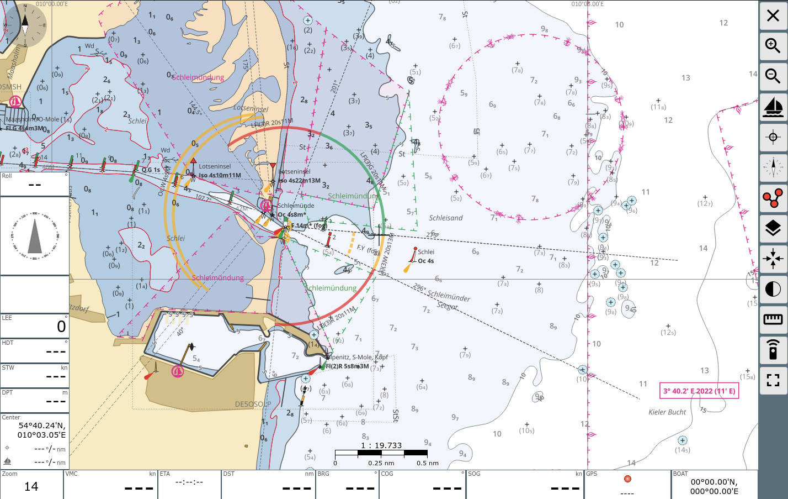
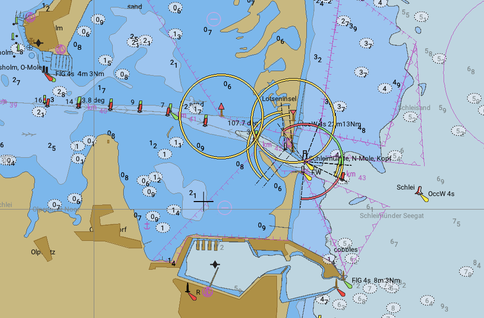

# Download

Here you find precompiled charts for download in various formats usable in different applications.

??? danger "Disclaimer"
    The charts and data files provided are for informational and reference purposes only. They are not intended for navigation, official maritime operations, or any activity requiring precise geographic, hydrographic data. Users should consult official sources, such as government agencies or certified navigation providers, for authoritative and up-to-date navigation information.
    
    No warranty, express or implied, is given regarding the accuracy, reliability, or completeness of the provided charts. The provider assumes no responsibility or liability for any errors, omissions, or misuse of this information. 
    
    **Use at your own risk!**

??? info "License"    
    The downloadable files on this page are licensed under [CC0](https://creativecommons.org/publicdomain/zero/1.0/).

!!! failure
    The BSH [changed](https://www.geoseaportal.de/de/news.xml) its [WMS server](https://gdi.bsh.de/public/public_services.html). They do no longer provide vector data. 
    Data for Germany may still be updated but may contain errors in the depth contour areas!
    Nav aids and contour lines should be correct, though.
    
!!! tip "Vector Data"
    S57 files containing vector charts for AVNav and OpenCPN have been added. For AVNav these chart can be rendered by [Ocharts(NG)](https://www.wellenvogel.net/software/avnav/docs/hints/ochartsng.html). 

!!! info
    - An additional contours layer was added, that only contains depth contours. It could be used as a base for OpenSeaMap.
    - Raster charts are encoded with [WebP](https://en.wikipedia.org/wiki/WebP) to reduce file size. This might not work in all applications.
      PNG based tiles are available, too.
    - The german chart includes spot sounding extracted from <https://www.geoseaportal.de/atomfeeds/ELC_INSPIRE_de.xml> which is from 2018 and was last updated 2023-05!
      This is experimental, data can be wrong or missing. Spot soundings and contour lines are from different datasets, so they may mismatch in certain areas.  

??? note "Data Sources"
    The charts provided by this project are based on data by
    
    - :de: [BSH](https://www.bsh.de/)
        - [GeoSeaPortal](https://www.geoseaportal.de/mapapps/resources/apps/navigation/) ([GeoNutzV](https://www.bsh.de/DE/THEMEN/Geoinformationen/_Anlagen/Downloads/Geonutzv.pdf?__blob=publicationFile&v=2))
        - [Bathymetry](https://www.geoseaportal.de/atomfeeds/ELC_INSPIRE_de.xml) ([DL-DE->BY-2.0](https://www.govdata.de/dl-de/by-2-0))
        - [SKN Seekartenull](https://data.bsh.de/OpenData/Main/SKN_Nordsee_2021/) (?)
        - [Tidal Data](https://data.bsh.de/OpenData/Main/) ([GeoNutzV](https://www.bsh.de/DE/THEMEN/Geoinformationen/_Anlagen/Downloads/Geonutzv.pdf?__blob=publicationFile&v=2)?)
    - :nl: [RWS](https://www.rijkswaterstaat.nl/)
        - [ENC](https://www.vaarweginformatie.nl/frp/main/#/page/infra_enc) (?)
        - [Vaarwegmarkeringen drijvend](https://data.overheid.nl/dataset/5eb0f65c-e90f-464e-8f46-01c5eeb6adf5) ([CC0 1.0](https://creativecommons.org/publicdomain/zero/1.0/deed.en))
        - [Vaarwegmarkeringen vast](https://data.overheid.nl/dataset/2bf96f3b-128d-4506-85e0-08e8fc19a11c) ([CC0 1.0](https://creativecommons.org/publicdomain/zero/1.0/deed.en))

??? note "Raw Data"
    Raw data files are available here. They can be used in [QGIS](https://qgis.org/) to render your own charts or to investigate or play with dat data. The QGIS file used in this project can be found on [GitHub](https://github.com/quantenschaum/mapping/tree/master/qgis).
    
    - [BSH Data](bsh.gpkg){:download}
    - [BSH Soundings](soundg-de.gpkg){:download}
    - [BSH QGIS-Project](bsh.qgs){:download}
    - [RWS Waddenzee](waddenzee.gpkg){:download}
    - [RWS QGIS-Project](rws.qgs){:download}
    - [Icons](icons.zip){:download}

## [OsmAnd](https://osmand.net/)

### Vector Charts

Vector charts and styles for OsmAnd can be installed by simply opening the `obf` or `xml` file with the OsmAnd app, it will automatically import the file and use it as part of the "offline vector chart". (also see [usage](usage.md#vector-charts))

- [:de: QMAP DE (nav aids)](qmap-de.obf){:download}
- [:de: Depth Contours DE](depth-de.obf){:download}
- [:de: Spot Soundings DE](soundg-de.obf){:download}
- [:nl: Depth Data NL](depth-nl.obf){:download}
- [:globe_with_meridians: Light Sectors Worldwide](lightsectors.obf){:download}
- [:material-xml: Marine Rendering Style](marine.render.xml){:download}

!!! warning
    The vector chart will not be rendered properly without the marine rendering style and render engine 2 (OpenGL)!

### Raster Charts

The charts are imported by opening the `sqlitedb` files with the app. (also see [usage](usage.md#raster-charts))

- [:de: QMAP DE](qmap-de.sqlitedb){:download}
- [:de: QMAP Soundings DE](soundg-de.sqlitedb){:download}
- [:nl: QMAP NL](qmap-nl.sqlitedb){:download}
- [:de: Tidal Atlas DE](tides.sqlitedb.zip){:download}

#### Online Charts

- :de: QMAP DE online [`http://waddenzee.duckdns.org/qmap-de/{0}/{1}/{2}.webp`](http://osmand.net/add-tile-source?name=QMAP-DE&min_zoom=8&max_zoom=16&url_template=http://waddenzee.duckdns.org/qmap-de/%7B0%7D/%7B1%7D/%7B2%7D.webp)
- :nl: QMAP NL online [`http://waddenzee.duckdns.org/qmap-nl/{0}/{1}/{2}.webp`](http://osmand.net/add-tile-source?name=QMAP-NL&min_zoom=8&max_zoom=16&url_template=http://waddenzee.duckdns.org/qmap-nl/%7B0%7D/%7B1%7D/%7B2%7D.webp)

!!! tip
    Select `sqlitedb` as storage format. This will store the tiles more efficiently into a single database file.

## [AvNav](https://www.wellenvogel.net/software/avnav/docs/beschreibung.html?lang=en)

AvNav uses raster charts in form of [GEMF](https://www.wellenvogel.net/software/avnav/docs/charts.html#chartformats) files, but it also supports `mbtiles`, just not on Android. Simply drop the files into AvNav's `charts` folder.

- GEMF
    - [:de: QMAP DE](qmap-de.gemf){:download}
    - [:de: QMAP Contours DE](contours-de.gemf){:download}
    - [:de: QMAP Soundings DE](soundg-de.gemf){:download}
    - [:nl: QMAP NL](qmap-nl.gemf){:download}
    - [:de: Tidal Atlas DE](tides.gemf.zip){:download}
- MBTILES
    - [:de: QMAP DE](qmap-de.mbtiles){:download}
    - [:de: QMAP Contours DE](contours-de.mbtiles){:download}
    - [:de: QMAP Soundings DE](soundg-de.mbtiles){:download}
    - [:nl: QMAP NL](qmap-nl.mbtiles){:download}
    - [:de: Tidal Atlas DE](tides.mbtiles.zip){:download}
- S57/SENC
    - [:de: QMAP DE](qmap-de.zip){:download}

??? tip "SENC Vector Charts"
    The SENC files can be used with the [Ocharts(NG)](https://www.wellenvogel.net/software/avnav/docs/hints/ochartsng.html) plugin.

    

## [OpenCPN](https://opencpn.org/)

OpenCPN and other applications can display raster charts from `mbtiles`.

- [:de: QMAP DE](qmap-de.png.mbtiles){:download}
- [:de: QMAP Contours DE](contours-de.png.mbtiles){:download}
- [:de: QMAP Soundings DE](soundg-de.png.mbtiles){:download}
- [:nl: QMAP NL](qmap-nl.png.mbtiles){:download}

!!! info
    OpenCPN does not support WebP, so there are separate `mbtiles` files containing png tiles.

## [JOSM](https://josm.openstreetmap.de/)

The raster charts can be added to JOSM as [imagery layers](https://josm.openstreetmap.de/wiki/Help/Preferences/Imagery).

- :de: QMAP DE `tms:http://waddenzee.duckdns.org/qmap-de/{zoom}/{x}/{y}.png`
- :nl: QMAP NL `tms:http://waddenzee.duckdns.org/qmap-nl/{zoom}/{x}/{y}.png`

You may also want to [add this extra `mapcss`](https://josm.openstreetmap.de/wiki/Help/Preferences/MapPaintPreference) (as last entry) for improved rendering of seamarks.

- `https://raw.githubusercontent.com/quantenschaum/mapping/refs/heads/icons/extra.mapcss`
