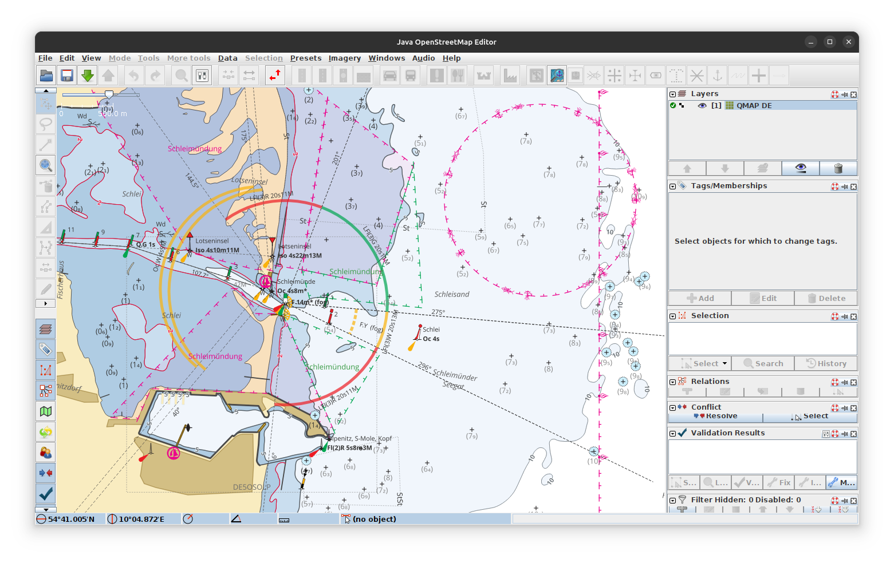
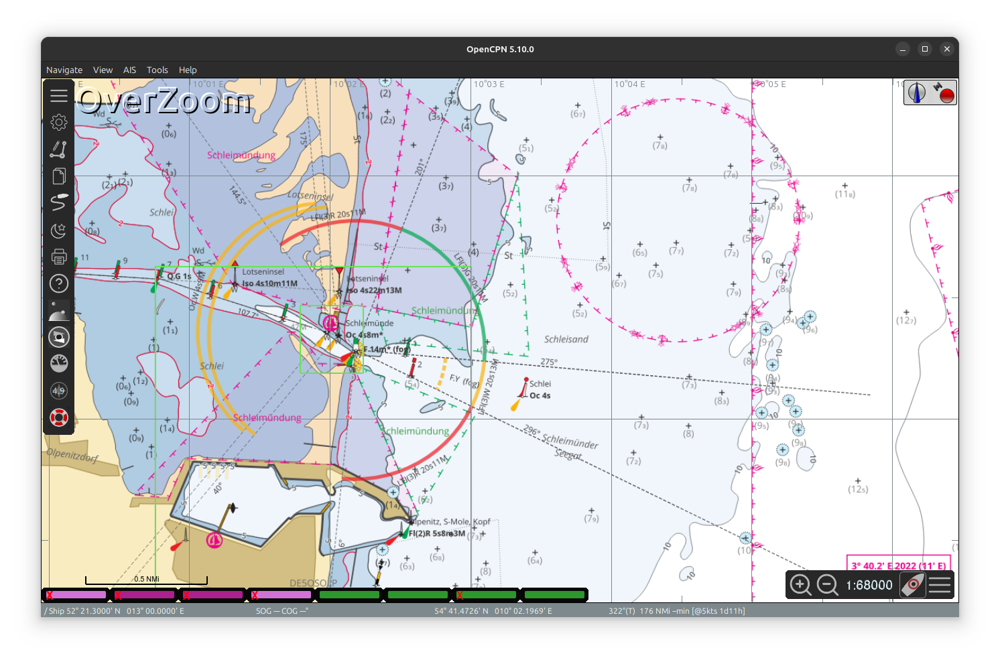

# Download

Here you find precompiled charts for download in various formats usable in different applications.

The downloadable files on this page are licensed under [CC0](https://github.com/quantenschaum/mapping/blob/master/LICENSE).

!!! info
    Raster charts are now encoded with [WebP](https://en.wikipedia.org/wiki/WebP) to reduce file size. This might not work in all applications.

## [OsmAnd](https://osmand.net/)

### Vector Charts

Vector charts and styles for OsmAnd can be installed by simply opening the `obf` or `xml` file with the OsmAnd app, it will automatically import the file and use it as part of the "offline vector chart". (also see [usage](usage.md#vector-charts))

- [:de: QMAP DE](qmap-de.obf){:download}
- [:de: Depth Contours DE](depth-de.obf){:download}
- [:nl: Depth Data NL](depth-nl.obf){:download}
- [:no: Depth Data NO east](depth-no-east.obf){:download}
- [:no: Depth Data NO west](depth-no-west.obf){:download}
- [:no: Depth Data NO mid](depth-no-mid.obf){:download}
- [:no: Depth Data NO north](depth-no-north.obf){:download}
- [:globe_with_meridians: Light Sectors Worldwide](lightsectors.obf){:download}
- [:material-xml: Marine Rendering Style](marine.render.xml){:download}

!!! warning
    The vector chart will not be rendered properly without the marine rendering style and render engine 2 (OpenGL)!

### Raster Charts

The charts are imported by opening the `sqlitedb` files with the app. (also see [usage](usage.md#raster-charts))

- [:de: QMAP DE](qmap-de.sqlitedb){:download}
- [:nl: QMAP NL](qmap-nl.sqlitedb){:download}
- [:de: Tidal Atlas DE](tides.sqlitedb.zip){:download}

#### Online Charts

- :de: QMAP DE online [`http://waddenzee.duckdns.org/qmap-de/{0}/{1}/{2}.webp`](http://osmand.net/add-tile-source?name=QMAP-DE&min_zoom=8&max_zoom=16&url_template=http://waddenzee.duckdns.org/qmap-de/%7B0%7D/%7B1%7D/%7B2%7D.webp)
- :nl: QMAP NL online [`http://waddenzee.duckdns.org/qmap-nl/{0}/{1}/{2}.webp`](http://osmand.net/add-tile-source?name=QMAP-NL&min_zoom=8&max_zoom=16&url_template=http://waddenzee.duckdns.org/qmap-nl/%7B0%7D/%7B1%7D/%7B2%7D.webp)

!!! tip
    Select `sqlitedb` as storage format.

## [AvNav](https://www.wellenvogel.net/software/avnav/docs/beschreibung.html?lang=en)

AvNav uses raster charts in form of [GEMF](https://www.wellenvogel.net/software/avnav/docs/charts.html#chartformats) files. Simply drop the files into AvNav's `charts` folder.

- [:de: QMAP DE](qmap-de.gemf){:download}
- [:nl: QMAP NL](qmap-nl.gemf){:download}
- [:de: Tidal Atlas DE](tides.gemf.zip){:download}

## [JOSM](https://josm.openstreetmap.de/)

The raster charts can be added to JOSM as [imagery layers](https://josm.openstreetmap.de/wiki/Help/Preferences/Imagery).

- :de: QMAP DE `tms:http://waddenzee.duckdns.org/qmap-de/{zoom}/{x}/{y}.png`
- :nl: QMAP NL `tms:http://waddenzee.duckdns.org/qmap-nl/{zoom}/{x}/{y}.png`

You may also want to add this extra `mapcss` for better rendering of seamarks.

- `https://raw.githubusercontent.com/quantenschaum/mapping/icons/extra.mapcss`

## [OpenCPN](https://opencpn.org/)

OpenCPN and other applications can display raster charts from `mbtiles`.

- [:de: QMAP DE](qmap-de.mbtiles){:download}
- [:nl: QMAP NL](qmap-nl.mbtiles){:download}
- [:de: Tidal Atlas DE](tides.mbtiles.zip){:download}
